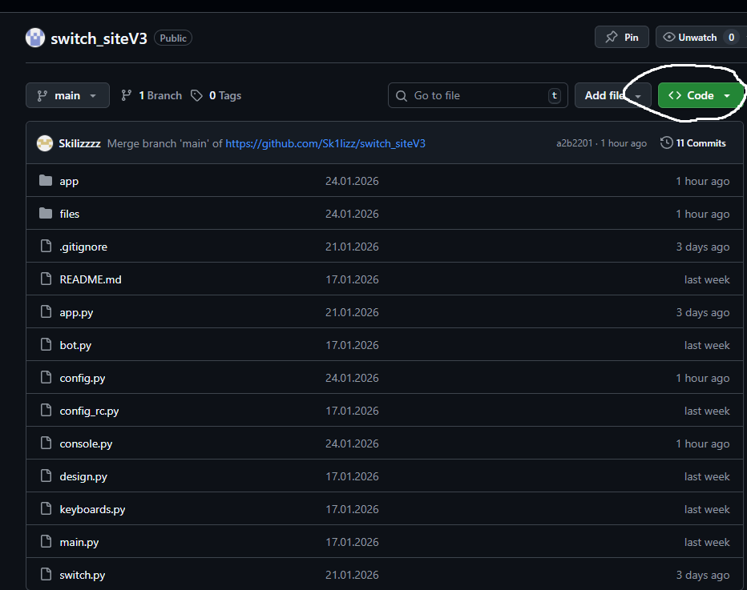
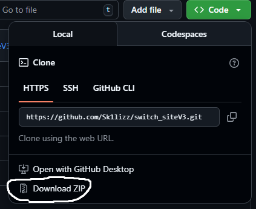

# Wiki - Switch Site by skilizz

Switch Site V3 - улучшенная версия прошлой программы, были исправлены ошибки и добавлено приложение.


## Установка программы.

### 1 шаг.

Для начала необходимо установить Python.

Скачать можно по [ссылке](https://www.python.org/downloads/).


Более полный гайд можно получить по [ссылке](https://practicum.yandex.ru/blog/kak-ustanovit-python-na-kompyuter/#kakoi-python-vybrat) (Дзен).


Проект написан на версии 3.13.9


### 2 шаг.

Установка папки проекта себе на компьютер.

#### 1 Вариант.&#x20;

С помощью git.


Скачать git можно [тут](https://git-scm.com/install/).


Команда:

```
git clone https://github.com/Sk1lizz/switch_siteV3.git
```


#### 2 Вариант.

С помощью github.

Переходим по [ссылке](https://github.com/Sk1lizz/switch_siteV3).&#x20;

Нажимаем кнопку <mark style="background-color:$success;"><> Code</mark>&#x20;

Download ZIP

<figure><figcaption></figcaption></figure>

<figure><figcaption></figcaption></figure>

И распаковываем в папку.


