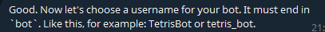
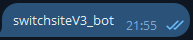
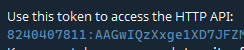
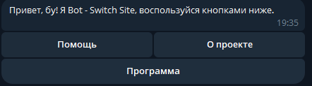
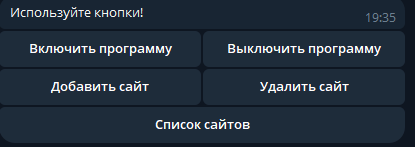
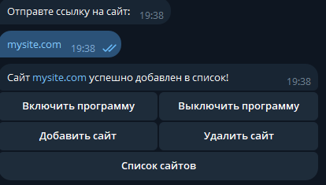
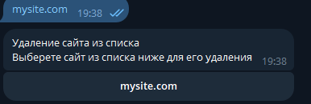
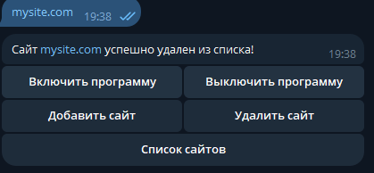
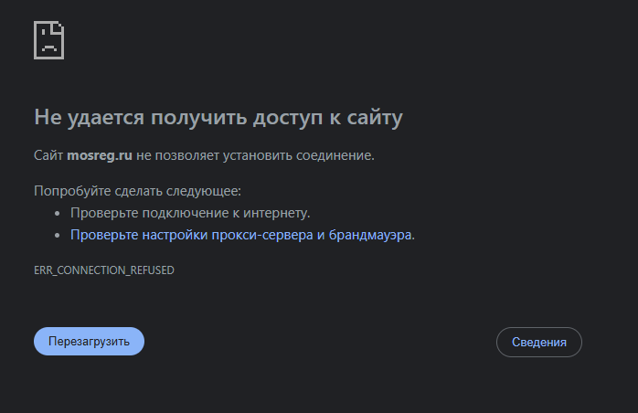
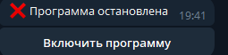

# Телеграм версии.

## Активация telegram бота.


Применяем такое настройки в files\config\config.json


```json
"bot-telegram": true, 
"app": false,
"console": false,
```

Создаем бота в [BotFather](https://t.me/BotFather)

Далее <mark style="color:blue;">/newbot</mark> -> (Название бота) -> (Юз бота c bot на конце)

<figure><figcaption></figcaption></figure>

<figure><figcaption></figcaption></figure>

<figure><figcaption></figcaption></figure>

После выходит сообщение с токеном и ссылкой на бота.

<figure><figcaption></figcaption></figure>

Токен вставляет в files\config\bot.json

```
{
    "token": "сюда ваш токен",
    "name": "Bot - Switch Site"
}
```

После активируем программу.


Заходим в бота и пишем команду <mark style="color:blue;">/start</mark>

<figure><figcaption></figcaption></figure>


Далее кнопка Программа.

<figure><figcaption></figcaption></figure>


После Добавить сайт и пишем наш сайт.

<figure><figcaption></figcaption></figure>


Если получилось такое сообщение, то функция добавления работает корректно.


После Удалить сайт и выбираем наш сайт.

<figure><figcaption></figcaption></figure>

<figure><figcaption></figcaption></figure>

Если получено такое сообщение то функция удаления сайта работает корректно.


После добавляем любой сайт и включаем программу.

<figure><figcaption></figcaption></figure>

Подождав пару минут пробуем зайти на наш сайт.


<figure><figcaption></figcaption></figure>

Если выходит такая ошибка, а после выключения заходит, то наша программа работает корректно.


<figure><figcaption></figcaption></figure>


Для остановки бота достаточно выключить компьютер или закрыть консоль.


<mark style="background-color:$danger;">Прошу заметить, что при включенной программе и закрытии бота, программа не выключится.</mark>
