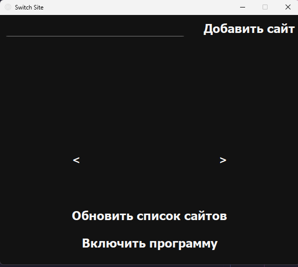
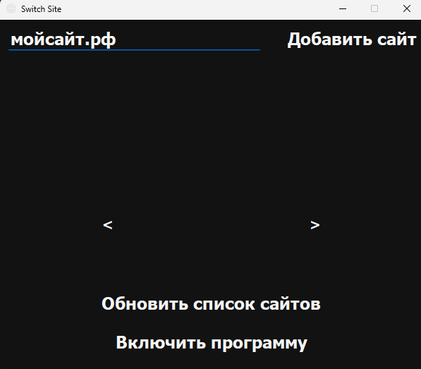
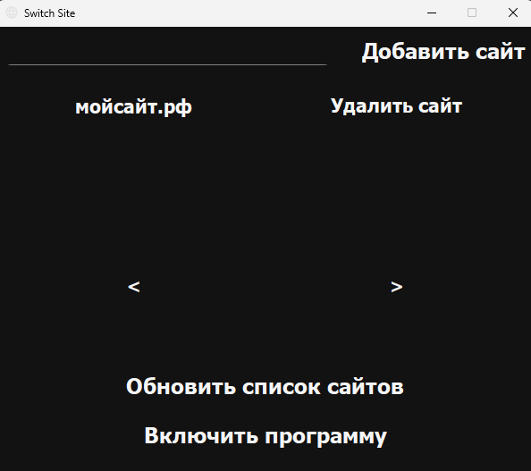
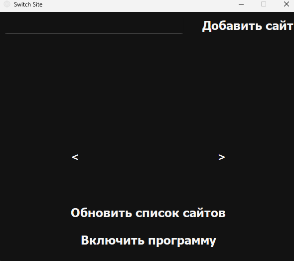
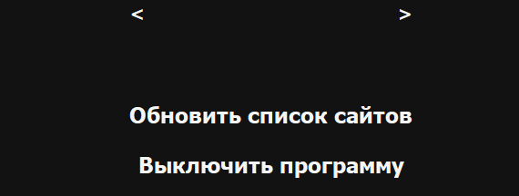

# Версия с приложением.

## Активация приложения.


Применяем такое настройки в files\config\config.json


```json
"bot-telegram": false, 
"app": true,
"console": false,
```

После активируем программу.


<figure><figcaption></figcaption></figure>

Если открывается данное окно, то приложение успешно запущено.


Далее добавляем сайт.

<figure><figcaption></figcaption></figure>


Если он появляется в колонке ниже, то добавление работает, сразу же пробуем удалить сайт.

<figure><figcaption></figcaption></figure>

<figure><figcaption></figcaption></figure>


Далее добавляем сайт и пробуем запустить программу.

<figure><figcaption></figcaption></figure>


Заходим на сайт и если выходит подобная ошибка, то приложение работает.

<figure><figcaption></figcaption></figure>


Выключаем и пробуем заново зайти, если пускает, то все работает замечательно.


Закрытие происходит при закрытии программы или закрытию консоли.

<mark style="background-color:$danger;">Прошу заметить, что при включенной программе и закрытии приложения, программа не выключится.</mark>
